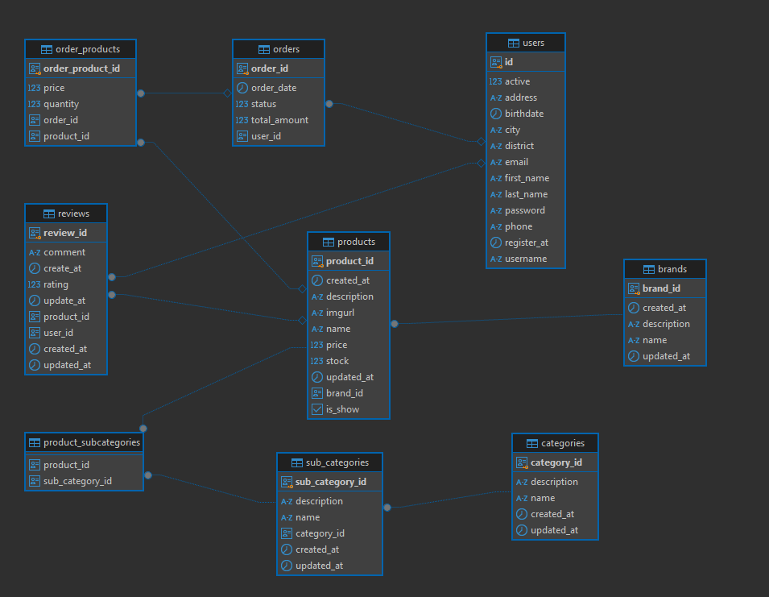

# E-Commerce Website Documentation

## Introduction

### **Project Overview**

This project is a comprehensive **E-Commerce Website** designed to provide a seamless online shopping experience while offering robust administrative tools for managing the platform.

### **Technologies Used**

- **Frontend**: Angular, TailwindCSS
- **Backend**: Spring Boot 3, Java JDK 21
- **Database**: PostgreSQL
- **Supporting Tools**: Keycloak (Authentication & Authorization), Jasper (Report Management), Camunda (Workflow Automation)

---

## Key Features

### **For Customers**

- User-friendly authentication: Login, Logout, and Password Recovery.

### **For Admins**

- **Product Management**: Create, read, update, and delete (CRUD) for products, brands, categories, and subcategories.
- **Authorization & Authentication**: Managed through **Keycloak** for secure access control.
- **Report Handling**: Export and import reports using **Jasper**.
- **Workflow Automation**: Simplified product addition process with **Camunda**, enabling efficient management through the admin dashboard.

---

## Installation Guide

### **System Requirements**

- **Environment**:
  - Node.js
  - Java JDK 21
  - Docker

### **Setup Instructions**

1. **Clone the Repository**.
2. **Start Keycloak**:
   - Navigate to `Keycloak_Provider/UserProvider`.
   - Run `docker compose up -d`.
   - Access Keycloak at [http://localhost:9091](http://localhost:9091) (username and password: `admin`).
   - Create a realm, client ID, and client secret.
   - Copy the configuration and paste it into the backend project's `application.properties` file located at `EcommerceBE/src/main/resources/application.properties`.
3. **Run the Backend**:
   - Navigate to the backend directory (`EcommerceBE`).
   - Run the command: `mvn spring-boot:run`.
   - The backend will start on **port 8081**.
4. **Configure the Frontend**:
   - Paste the Keycloak configuration into `EcommerceFE/src/app/services/keycloak/keycloak.service.ts`.
5. **Run the Frontend**:
   - Navigate to the frontend directory (`EcommerceFE`).
   - Run the command: `npm start`.
   - The frontend will start on **port 4200**.

---

## Usage

1. Access the application at [http://localhost:4200](http://localhost:4200).
2. Register a new account.
3. Login to Keycloak at [http://localhost:9091](http://localhost:9091):
   - Navigate to your realm.
   - Create the realm role `admin`.
   - Assign the `admin` role to your account via **Role Mapping** under the user settings.
4. Log in to the admin panel at [E-Commerce Admin Panel](http://localhost:4200/admin) using your account.

---

## Database Schema

Below is the database schema for the project, illustrating its structure and relationships:  

---

This documentation ensures ease of setup, usage, and management of the E-Commerce platform for both developers and administrators.
